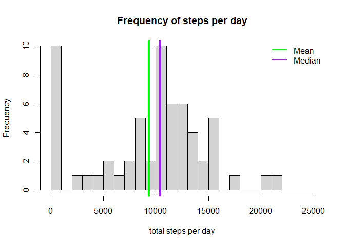
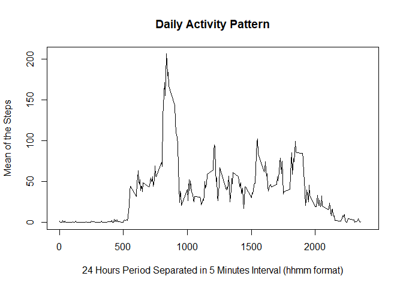
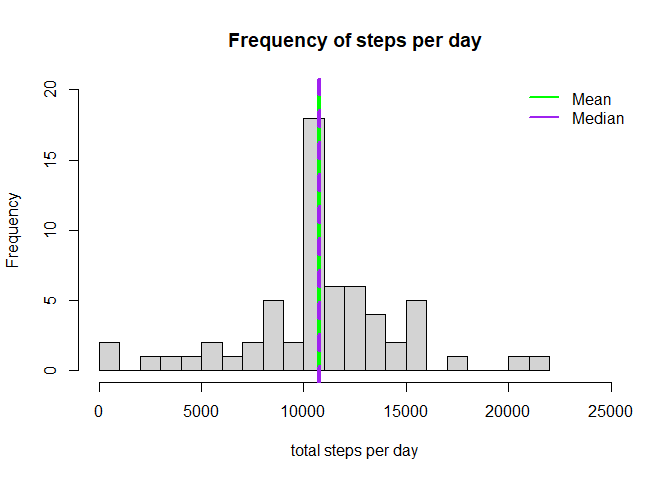
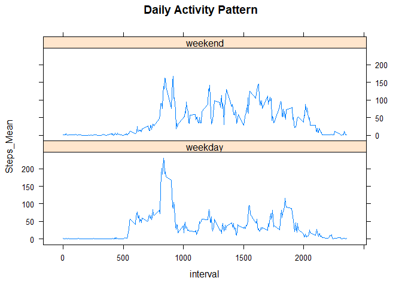

## Loading and preprocessing the data
Loading the file and transforming the column named 'date' to the Date class.

```r
unzip("activity.zip")
activity <- read.csv("activity.csv")
activity[,2]= as.Date(activity[,2])
```

## What is the mean of the total number of steps taken per day?

The total steps per day are summed up using the 'summarise' function, and with that we can plot the histogram and calculate the mean and median.


```r
library(dplyr)
```

```
## 
## Attaching package: 'dplyr'
```

```
## The following objects are masked from 'package:stats':
## 
##     filter, lag
```

```
## The following objects are masked from 'package:base':
## 
##     intersect, setdiff, setequal, union
```

```r
steps_per_day <- summarise(group_by(activity,date), Steps=sum(steps, na.rm = TRUE))
```

```
## `summarise()` ungrouping output (override with `.groups` argument)
```

```r
ST_mean <- mean(steps_per_day$Steps, na.rm = TRUE)
ST_mean <- format(round(ST_mean, 2), nsmall = 2)
ST_median <- median(steps_per_day$Steps, na.rm = TRUE)
hist(steps_per_day$Steps, breaks=20, xlab="total steps per day", main="Frequency of steps per day", xlim = c(0,25000))
abline(v=ST_mean, col="green", lwd=4)
abline(v=ST_median, col="purple", lwd=4)
legend(x="topright", legend=c("Mean","Median"), col=c("green","purple"), bty="n", lwd=2.5)
```

<!-- -->

The mean of the total number of steps taken per day is **9354.23** and the median is **10395**.


## What is the average daily activity pattern?

The average daily activity pattern is calculated with the mean of each 5-minutes interval over all days using the 'summarise' function. The daily activity pattern is plotted as a 24 hours time series. After that we found the maximum value e checked in which period of the this pattern occurs.


```r
steps_per_interval <- summarise(group_by(activity,interval), Steps_Mean=mean(steps, na.rm = TRUE))
```

```
## `summarise()` ungrouping output (override with `.groups` argument)
```

```r
plot(steps_per_interval$interval, steps_per_interval$Steps_Mean, type = "l", xlab="24 Hours Period Separated in 5 Minutes Interval (hhmm format)", main="Daily Activity Pattern", ylab = "Mean of the Steps"  , xlim = c(0,2400))
```

<!-- -->

```r
max_Steps_Interval <- steps_per_interval[which.max(steps_per_interval$Steps_Mean),1]
max_steps_period <- sub('(\\d{2})$', ':\\1', max_Steps_Interval)
```
The 5-minute interval that contains the maximum number of steps is on **8:35am**.

## Imputing missing values


```r
na_values <- sum(is.na(activity))
```
There are **2304** intervals where there are missing values (coded as NA).

The chosen strategy for filling in all of the missing values in the dataset is to use the mean of the daily activity pattern for that 5-minute interval. To create the new dataset named activity2, we will use the 'transform' and 'ifelse' functions and after that we will calculate again the mean and median and plot again the histogram to compare with the previous one above. 


```r
activity2 <- transform(activity, steps=ifelse(is.na(steps), steps_per_interval$Steps_Mean, steps))
summary(activity2)
```

```
##      steps             date               interval     
##  Min.   :  0.00   Min.   :2012-10-01   Min.   :   0.0  
##  1st Qu.:  0.00   1st Qu.:2012-10-16   1st Qu.: 588.8  
##  Median :  0.00   Median :2012-10-31   Median :1177.5  
##  Mean   : 37.38   Mean   :2012-10-31   Mean   :1177.5  
##  3rd Qu.: 27.00   3rd Qu.:2012-11-15   3rd Qu.:1766.2  
##  Max.   :806.00   Max.   :2012-11-30   Max.   :2355.0
```


```r
steps_per_day2 <- summarise(group_by(activity2,date), Steps=sum(steps, na.rm = TRUE))
```

```
## `summarise()` ungrouping output (override with `.groups` argument)
```

```r
ST_mean2 <- mean(steps_per_day2$Steps, na.rm = TRUE)
ST_mean2 <- format(round(ST_mean2, 2), nsmall = 2)
ST_median2 <- median(steps_per_day2$Steps, na.rm = TRUE)
ST_median2 <- format(round(ST_median2, 2), nsmall = 2)
hist(steps_per_day2$Steps, breaks=20, xlab="total steps per day", main="Frequency of steps per day", ylim=c(0,20) ,xlim = c(0,25000))
abline(v=ST_mean2, col="green", lwd=4)
abline(v=ST_median2, col="purple", lwd=4, lty=2)
legend(x="topright", legend=c("Mean","Median"), col=c("green","purple"), bty="n", lwd=2.5)
```

<!-- -->
The mean of the total number of steps taken per day now is **10766.19** and the median is **10766.19**.

This means that both mean and median have increased and now they have the same value. Those values are related to an impact on the total number of steps, that have increased because of the additional values filled in the 2304 empty values.

## Are there differences in activity patterns between weekdays and weekends?

We created a new factor variable in the dataset with NA´s filled with two levels -- "weekday" and "weekend" indicating whether a given date is a weekday or weekend day.


```r
activity2$week <- factor(weekdays(activity2$date) %in% c("Samstag", "Sonntag"), labels = c("weekday", "weekend"))
head(activity2)
```

```
##       steps       date interval    week
## 1 1.7169811 2012-10-01        0 weekday
## 2 0.3396226 2012-10-01        5 weekday
## 3 0.1320755 2012-10-01       10 weekday
## 4 0.1509434 2012-10-01       15 weekday
## 5 0.0754717 2012-10-01       20 weekday
## 6 2.0943396 2012-10-01       25 weekday
```

After that, it was made a panel plot containing a time series plot of the 5-minute interval (x-axis) and the average number of steps taken divided by weekdays and weekend (y-axis). The interval of the daily activity pattern is plotted as a 24 hours time series.


```r
library(lattice)
steps_per_interval2 <- summarise(group_by(activity2,interval,week), Steps_Mean=mean(steps, na.rm = TRUE))
```

```
## `summarise()` regrouping output by 'interval' (override with `.groups` argument)
```

```r
xyplot(Steps_Mean ~ interval | week, data = steps_per_interval2, type="l", main= "Daily Activity Pattern" ,layout = c(1,2))
```

<!-- -->


